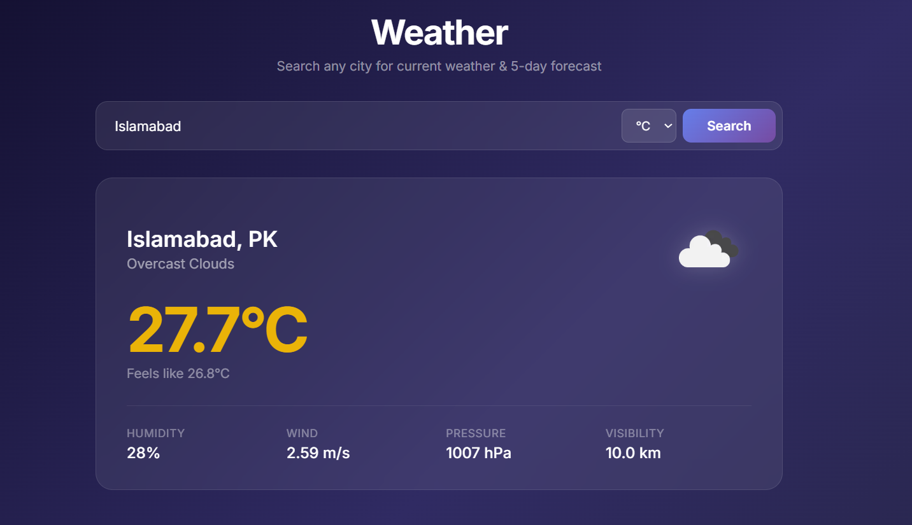
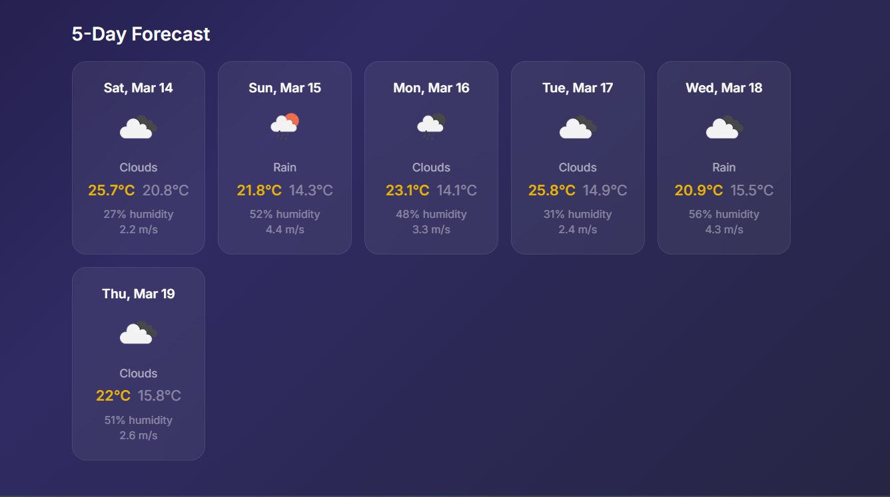

# Weather App

A beautiful weather web application with real-time data and 5-day forecasts.


## Features


- Current weather with OpenWeather icons
- 5-day forecast in responsive card grid
- Dark glassmorphism UI design
- Color-coded temperatures
- Metric and imperial unit support
- Responsive layout for mobile and desktop

## Screenshots

<p align="center">
	
	
</p>

## Installation

```bash
# Clone the repository
git clone https://github.com/yourusername/weather-app.git
cd weather-app

# Install dependencies
npm install
```

## Setup

1. Get a free API key at [openweathermap.org](https://openweathermap.org/api)
2. Create a `.env.local` file in the project root:

```
OPENWEATHER_API_KEY=your_api_key_here
```

## Usage

```bash
npm run dev
```

Open your browser and go to `http://localhost:3000`

## Tech Stack

- **Next.js** - React framework with App Router & Server Components
- **React** - UI library
- **CSS Modules** - Scoped component styling
- **OpenWeather API** - Weather data provider

## License

MIT
